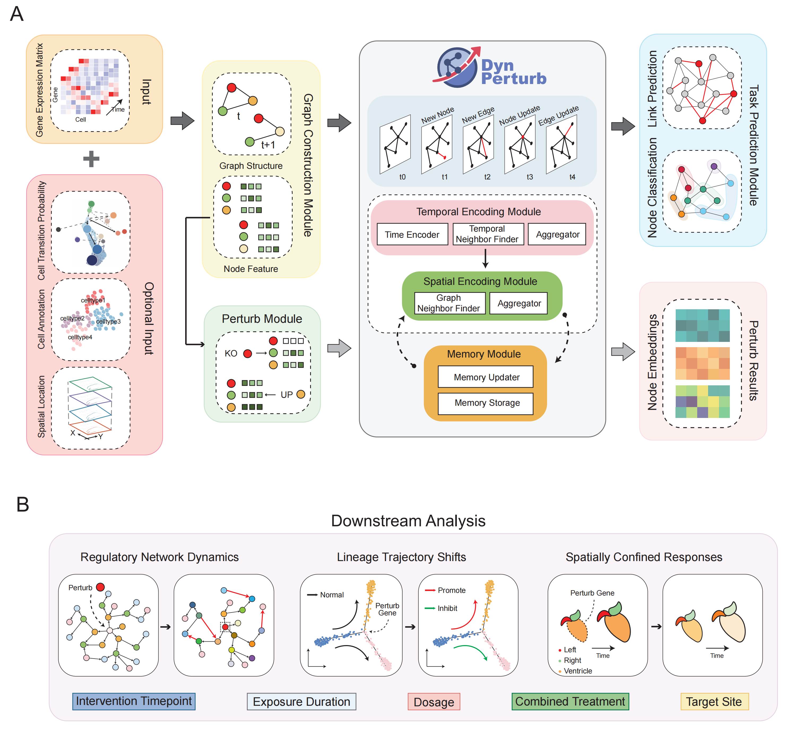

# DynPerturb：Dynamic Perturbation Modeling for Spatiotemporal Single-Cell Systems

## DynPerturb Overview
DynPerturb is an advanced deep learning model designed to infer gene regulatory networks (GRNs) and analyze the effects of perturbations on cellular states using single-cell RNA-seq data. By incorporating both temporal and spatial information, DynPerturb enhances the understanding of gene interactions during cellular development, disease progression, and response to perturbations, making it an invaluable tool for biologists and researchers in drug discovery, genetic studies, and disease modeling.



## Data
All training data and model parameters used in this study are available at https://bgipan.genomics.cn/#/link/t2YuR3VHmS0Jaozwqlvk (access code: p2Qv).

### Benchmark Data

Benchmark gene pairs for mESC and hESC datasets are avaliable fromhttps://github.com/xiaoyeye/TDL.

### GeneDyn Data

The data for Gene Regulatory Network (GRN) inference comes from the following dataset:
1. **Adult Human Kidney Single-Cell RNA-seq** (Version 1.5)
   - **Source**: [CellxGene Single-Cell Data](https://cellxgene.cziscience.com/e/dea717d4-7bc0-4e46-950f-fd7e1cc8df7d.cxg/)
   - This dataset includes single-cell gene expression profiles from different cell types of the human kidney.

### CellDyn Data
1. **Human Bone Marrow Hematopoietic Development** (Balanced Reference Map)
   - **Source**: [CellxGene Bone Marrow Data](https://cellxgene.cziscience.com/e/cd2f23c1-aef1-48ae-8eb4-0bcf124e567d.cxg/)
   - The dataset helps explore the differentiation process of blood cells from human bone marrow.

### SpatialDyn Data
1. **Murine Cardiac Development Spatiotemporal Transcriptome Sequencing**
   - **Source**: [Gigascience Article](https://doi.org/10.1093/gigascience/giaf012)
   - Provides a detailed spatial transcriptomic map of murine heart development, useful for understanding heart tissue differentiation and development.

## Requirements

The Python dependencies for this project are listed in the `requirements.txt` file.

1. **Download the `requirements.txt` file** from this repository.

2. **Create a conda environment** (if you don’t have one already):

   ```bash
   conda create --name DynPerturb python=3.10
   ```

3. **Activate the conda environment**:

   ```bash
   conda activate DynPerturb
   ```

4. **Install the dependencies** by running the following command:

   ```bash
   pip install -r requirements.txt
   ```

This will install all the Python dependencies needed for the project.

## Task1 : Temporal perturbation mapping reveals regulatory fragility in CKD tubule cells
**Training Command**

This script is used to train a **self-supervised model** for **link prediction** in graph-based data. The training process is designed to handle large-scale datasets and support **distributed training** using **PyTorch's DistributedDataParallel (DDP)**.

```bash
python train_main_link.py -d aPT-B --use_memory --memory_updater rnn  --message_function mlp > log.log 2>&1
```

- **`--use_memory`**:
   Enabling this option allows the model to incorporate **memory augmentation** for nodes during training. This can enhance the model's ability to remember historical interactions or patterns in the data, which is particularly useful for temporal graph models.
- **`--memory_updater rnn`**:
   This argument specifies the type of memory update mechanism to use. The `rnn` option uses a **Recurrent Neural Network (RNN)** to update and manage node memory over time, making it suitable for tasks that require temporal memory updates.
- **`--message_function mlp`**:
   The `mlp` option sets the **message function** used to process information between nodes. Specifically, it utilizes a **Multi-Layer Perceptron (MLP)** to aggregate and transform messages exchanged between nodes during the computation, allowing the model to learn complex relationships between nodes.

**Perturbation and Extraction of Node Features**

This script is designed to perform **perturbation and extraction of node features** in a **link prediction** task. Specifically, it involves the process of generating embeddings for nodes, extracting their features over time, and saving these embeddings for future use.

```bash
python train_ChangeNodeFeat_SaveEmbeddings_link.py --data HumanBone --bs 64 --n_epoch 100 --n_layer 1 
```

**Parameters**:

- `--data`: Dataset name, e.g., "HumanBone".
- `--bs`: Batch size for training.
- `--n_epoch`: Number of epochs.
- `--n_layer`: Number of network layers.
- `--lr`: Learning rate.


## Task2 : Lineage-specific transcription factor perturbations shape hematopoietic trajectories

**Training Command**

This script is used for **self-supervised node classification** training with **distributed data parallelism (DDP)** using PyTorch. The code supports multi-GPU and multi-node training environments to scale efficiently.

```bash
python train_main_ddp.py -d HumanBone --memory_dim 1000  --use_memory --numClasses > log.log 2>&1
```

- **`--memory_dim`**:
   Sets the dimension of the memory space for the model. The `memory_dim` controls how much memory each node will hold, which can influence model performance.

- **`--use_memory`**:
   This flag enables the use of **node memory augmentation**, which helps the model retain and utilize information from previous steps or nodes. This is particularly helpful for tasks requiring historical context.

- `--num_classes`:

  This argument specifies the **number of classes** for **node classification** tasks. It defines the total number of distinct categories or labels each node can be classified into during training. This parameter is essential for multi-class classification tasks, where the model predicts the class label for each node in the graph.

**Perturbation and Extraction of Node Features**

This script is designed for **distributed inference** on a temporal graph, focusing on **perturbation and extraction of node features** (i.e. embeddings), using a pretrained model. It computes temporal node embeddings across time and saves them for downstream tasks such as analysis or visualization.

```bash
python train_ChangeNodeFeat_SaveEmbeddings_ddp.py --data HumanBone --bs 64 --n_epoch 100 --n_layer 1 
```

**Parameters**:

- `--data`: The dataset name, for example, "HumanBone".
- `--bs`: Batch size used during training.
- `--n_epoch`: Number of epochs to train the model.
- `--n_layer`: Number of layers in the neural network.
- `--lr`: Learning rate for optimization.


## Task3 : Spatially resolved perturbations uncover region-specific regulation in cardiac development

**Training Command**

```bash
python train_main_ddp.py -d mouse --memory_dim 1000  --use_memory  > log.log 2>&1
```

**Perturbation and Extraction of Node Features**

```bash
python train_ChangeNodeFeat_SaveEmbeddings_ddp.py --data mouse --bs 64 --n_epoch 100 --n_layer 1 
```

**Parameters**:

- `--data`: The dataset name, for example, "HumanBone".
- `--bs`: Batch size used during training.
- `--n_epoch`: Number of epochs to train the model.
- `--n_layer`: Number of layers in the neural network.
- `--lr`: Learning rate for optimization.


## License


## Contact

